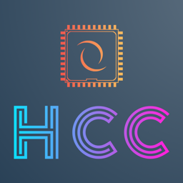

<p align="center">
	
</p>

<center><h1 align="center">Hero C Compiler</h1></center>

HCC is a C compiler that allows you to compile your C codebase (with limitations) to SPIR-V for the Vulkan graphics API. This means you can share struct's, enum's and functions between your CPU & GPU code. HCC targets the future of GPU programming so is designed around features such as bindless resources and scalar alignment. This makes it easier to interop with the GPU and focus on writing shader code without writing your own shader build system.

The project is currently in alpha, so expect bugs and please help by filing bugs and contributing back to the codebase :)

## Features
- Windows & Linux support
- Vulkan 1.3+
- Aims for C11 support
- Vertex, Pixel & Compute shader support
- Included Maths library for GPU programming (will be available to also be used CPU very soon!) [More Info](libhmaths/)
- Textures, Atomics, Quad & Wave Intrinsics [More Info](docs/intrinsics.md)
- \_Generic support for Maths & Intrinsics functions for C compliant overloads
- Vulkan interop code to help setup with your engine [More Info](docs/integrating_into_your_engine.md)
- 5 working samples and a samples application to see how it can plug into your engine [More Info](docs/release_package.md#sample-application)
- live playground application to have a play by writing shader code! [More Info](docs/release_package.md#playground-application)
- multiple shaders in a single file
- Compiler only depends on libc, optionally uses the SPIR-V tools for validation and optimization

## Limitations
- No pointer support outside compiler intrinsics
- No union support
- No debug info (planned soon after release)
- No string support (planned soon after release)
- No structure bitfields (planned soon after release)
- No static_assert (planned soon after release)
- No function scope struct, enum declarations (planned soon after release)
- No vector operator or swizzling (planned soon after release)
- No function pointers
- Minimal libc bundled with the compiler
- Vulkan 1.3+ with the following features:
	- vulkanMemoryModel
	- vulkanMemoryModelDeviceScope
	- shaderSampledImageArrayNonUniformIndexing
	- shaderStorageBufferArrayNonUniformIndexing
	- shaderStorageImageArrayNonUniformIndexing
	- shaderStorageTexelBufferArrayNonUniformIndexing
	- descriptorBindingSampledImageUpdateAfterBind
	- descriptorBindingStorageImageUpdateAfterBind
	- descriptorBindingStorageBufferUpdateAfterBind
	- descriptorBindingStorageTexelBufferUpdateAfterBind
	- descriptorBindingPartiallyBound
	- scalarBlockLayout
	- shaderDemoteToHelperInvocation
	- for each **format** used as a STORAGE_IMAGE you'll need check for the following:
		- VK_FORMAT_FEATURE_2_STORAGE_READ_WITHOUT_FORMAT_BIT  (HccRoTexture, HccRwTexture)
		- VK_FORMAT_FEATURE_2_STORAGE_WRITE_WITHOUT_FORMAT_BIT (HccWoTexture, HccRwTexture)

## What does it look like?

Here is a vertex & pixel shader triangle sample:
```c
typedef struct Vertex Vertex;
struct Vertex {
    f32x2    pos;
    uint32_t color;
};

typedef struct TriangleBC TriangleBC;
struct TriangleBC {
    HccRoBuffer(Vertex) vertices;
    f32x4               tint;
};

typedef struct RasterizerState RasterizerState;
HCC_RASTERIZER_STATE struct RasterizerState {
    HCC_INTERP f32x4 color;
};

HCC_VERTEX void triangle_vs(
    HccVertexSV const* const sv,
    HccVertexSVOut* const sv_out,
    TriangleBC const* const bc,
    RasterizerState* const state_out
) {
    Vertex vertex = bc->vertices[sv->vertex_idx];

    sv_out->position = f32x4(vertex.pos.x, vertex.pos.y, 0.f, 1.f);
    state_out->color = mulG(unpack_u8x4_f32x4(vertex.color), bc->tint);
}

typedef struct Pixel Pixel;
HCC_PIXEL_STATE struct Pixel {
    f32x4 color;
};

HCC_PIXEL void triangle_ps(
    HccPixelSV const* const sv,
    HccPixelSVOut* const sv_out,
    TriangleBC const* const bc,
    RasterizerState const* const state,
    Pixel* const pixel_out
) {
    pixel_out->color = state->color;
}
```

## Great, how do I find out more?

You can download the latest release [here](https://github.com/heroseh/hcc/releases/):

We also have the documentation you can check out [here](docs/)

# Support

If enjoy using the project, please consider sending a tip to show your support. Thank you! :)

[](https://ko-fi.com/hero_dev)

## FAQ
- Q: Do you plan on DX12 or Metal support?
	- A: Yes, when I personally need to port a project of mine over.
	If you would like to speed this up, I am open to work with a contributor who is willing to do the port.
	The compiler is structured in such a way where you 'just' need to do a DXIL or MSL backend. Please use the Discord or file an Github issue if you wish to coordinate on one of these backends.

- Q: Do you plan on supporting Mesh & Ray Tracing shaders?
	- A: Yes in future when I need them personally, but I am open to coordinate with someone who is willing to implement them. Please use the Discord or file an Github issue if you wish to work on this.

- Q: Do you plan on supporting OpenGL or DX11?
	- A: No, unfortunately we are targeting the future of graphics programming and this is in compatible with older graphics APIs :(

# Community

We have a [Discord](https://discord.gg/FUsK4z97C9) community for any HCC discussion or to be involved in a low-level C / Gamedev / Graphics community

Catch live development on the compiler at [Twitch](https://twitch.tv/hero_dev)

# Contributor

If you like the project and are a competent C programmer, please consider being a contributor. Join the Discord or open up some Github issues related to the features you want to work on.

