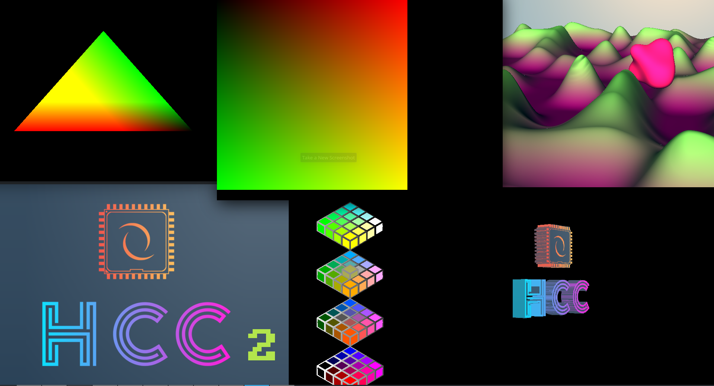
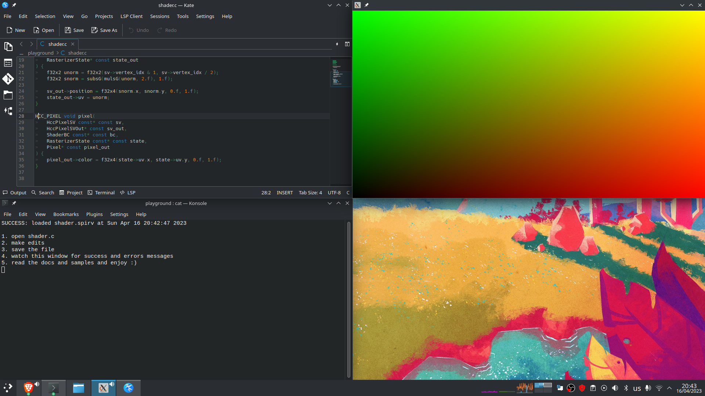
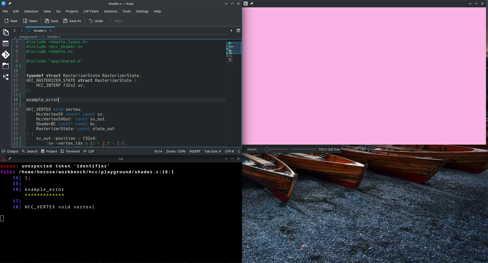

# Release Package Docs

- [What is in the Release Package?](#what-is-in-the-release-package)
- [Sample Application](#sample-application)
	- [What samples do you have?](#what-samples-do-you-have)
	- [How do I run the application?](#how-do-i-run-the-sample-application)
	- [How do I change between samples?](#how-do-i-change-between-samples)
	- [How do I recompile my own local changes to the samples code?](#how-do-i-recompile-my-own-local-changes-to-the-samples-code)
- [Playground Application](#playground-application)
	- [How do I run the application?](#how-do-i-run-the-playground-application)
	- [Working Example](#working-example)
	- [Error Example](#error-example)
	- [How do I recompile my own local changes to the playground/app/\* code?](#how-do-i-recompile-my-own-local-changes-to-the-playgroundapp-code)

## What is in the Release Package?

- **Compiler & Libraries:**
	- hcc | [docs](command_line.md)
	- libc (minimal GPU version of libc) | [docs](intrinsics.md#libc)
	- libhccintrinsics (shader programming intrinsics) | [docs](intrinsics.md)
	- libhmaths (vector & matrix maths) | [docs](../libhmaths)

- **Sample Application:**
	- samples/\* | [docs](#sample-application)
- **Playground Application:**
	- playground/\* | [docs](#playground-application)

- **Engine Integration helpers:**
	- interop/\* | [docs](integrating_into_your_engine.md)

## Sample Application

A minimal Vulkan application designed to demo some sample shaders and to show integrating in with Vulkan. You can have a play by editing the sample app or shader code.



#### What samples do you have?
- **samples/triangle.c**
	- Most basic vertex & pixel shader
- **samples/compute-square.c**
	- Most basic compute shader
- **samples/texture.c**
	- Showing most of the texture intrinsics
- **samples/alt-2.5d-rgb-color-picker.c**
	- Ray-marched animated cube as a medium example and test of the compiler and libraries
- **samples/blob-vacation.c**
	- Ray-marched animated blob as a medium example and test of the compiler and libraries
- **samples/voxel-raytracer.c**
	- Ray-traced voxelize hcc logo medium example and test of the compiler and libraries

#### How do I run the sample application?
You can run the samples by double clicking on the **samples/samples[.exe]** application

#### How do I change between samples?
You can use the **'['** key to go to the previous shader sample and **']'** to go to the next shader sample

#### How do I recompile my own local changes to the samples code?
Linux
```
cd samples/
run.sh
```
Windows
```
cd samples/
run.bat
```

## Playground Application

A minimal **shadertoy** clone that reloads changes to **playground/shader.c** file on the fly and displays the latest valid shader on the main window. While errors and messages get displayed in a console window.

#### How do I run the playground application?
You can run the playground by double clicking on the **playground/playground[.exe]** application and follow the instruction on the terminal window that appear

#### Working Example

#### Error Example


#### How do I recompile my own local changes to the playground/app/\* code?
Linux
```
cd playground/
run.sh
```
Windows
```
cd playground/
run.bat
```
